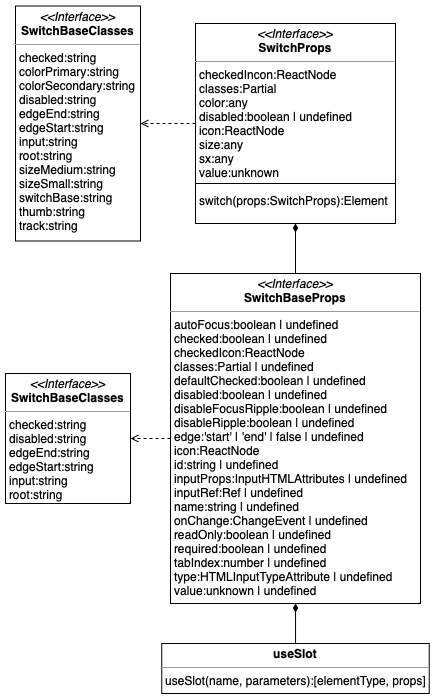

# Report for assignment 4

## Project

Name: Material UI

URL: https://github.com/mui/material-ui/

Material UI is a comprehensive library of React components that features our independent implementation of Google's Material Design system. (from their GitHub README)

## Onboarding experience

For this this project we decided to pick a new project to work with. The project we choose for the last assignment felt a bit to complex and there weren't any issues 
that we perceived we would have time to address in the time that was available. The new program was easier to grasp, partly thanks to its visual nature but also a more comprehensible code base. 

## Effort spent

For each team member, how much time was spent in

1. plenary discussions/meetings;
    - Everyone: 6 hours

2. discussions within parts of the group;
    - Linus: 15 minutes
    - Ellen: 15 minutes
    - Robin: 15 minutes

3. reading documentation;
    - Linus: 1 hour
    - Ellen: 3 hours
    - Robin: 5 hours

4. configuration and setup;
    - Linus:
      - pnpm installation: 30 minutes
      - testing setup: 15 minutes
    - Ellen: 
      - pnpm installation: 1 hours
      - testing setup: 15 minutes
    - Robin: 0 hours

5. analyzing code/output;
    - Linus: 5 hours
    - Ellen: 5 hours
    - Robin: 5 hours

6. writing documentation;
    - Linus: 1 hour
    - Ellen: 4 hours
    - Robin: 4 hours

7. writing code;
    - Linus: 5 hours
    - Ellen: 0 hours
    - Robin: 0 hours

8. running code?
    - Linus: 1 hour
    - Ellen: 0 hours
    - Robin: 0 hours

For setting up tools and libraries (step 4), enumerate all dependencies
you took care of and where you spent your time, if that time exceeds
30 minutes.

## Overview of issue(s) and work done.

Title: [Switch] disabled prop doesn't set aria-disabled on input element

URL: https://github.com/mui/material-ui/issues/45436

Summary: The unwanted behavior was that the aria-disabled is set on the span surrounding the input rather than the input directly. This caused problems for users relying on screen readers when navigating web pages and this creates accessibility issus with a rule of the Web Content Accessibility Guidlines (WCAG).

Scope: The code that is affected is related to the fundamental input html element and this will affect a lot of components using this element causing them to achive the wanted behavior and thus compliant with WCGAG.

## Code changes

### Patch

```diff
diff --git a/packages/mui-material/src/utils/useSlot.ts b/packages/mui-material/src/utils/useSlot.ts
index 90f9ffc4bd..6c8dfd97dc 100644
--- a/packages/mui-material/src/utils/useSlot.ts
+++ b/packages/mui-material/src/utils/useSlot.ts
@@ -135,6 +135,11 @@ export default function useSlot<
     {
       ...(name === 'root' && !rootComponent && !slots[name] && internalForwardedProps),
       ...(name !== 'root' && !slots[name] && internalForwardedProps),
+      ...((name === 'input' || elementType === 'input' || name.includes('input')) &&
+        'disabled' in ownerState &&
+        ownerState.disabled !== undefined && {
+          'aria-disabled': !!ownerState.disabled || undefined,
+        }),
       ...mergedProps,
       ...(LeafComponent &&
         !shouldForwardComponentProp && {
```


## Test results

>The test being ran are `/packages/mui-material/src/Switch/Switch.test.js`

Before touching the forked-repo:
```bash
158 passing (841ms)
```

Git diff for two new test cases:
```diff
diff --git a/packages/mui-material/src/Switch/Switch.test.js b/packages/mui-material/src/Switch/Switch.test.js
index 3f62c576b8..e986850094 100644
--- a/packages/mui-material/src/Switch/Switch.test.js
+++ b/packages/mui-material/src/Switch/Switch.test.js
@@ -159,4 +159,18 @@ describe('<Switch />', () => {
       expect(container.firstChild).to.have.class('test-class-name');
     });
   });
+
+  describe('accessibility', () => {
+    it('has attribute aria-disabled="true" when disabled', () => {
+      const { getByRole } = render(<Switch disabled />);
+
+      expect(getByRole('checkbox')).to.have.attribute('aria-disabled', 'true');
+    });
+
+    it('does not have aria-disabled when not disabled', () => {
+      const { getByRole } = render(<Switch />);
+
+      expect(getByRole('checkbox')).to.not.have.attribute('aria-disabled');
+    });
+  });
 });
```

The former test case fails before the patch:
```bash
159 passing (790ms)
12 pending
1 failing
1) <Switch />
      accessibility
        has attribute aria-disabled="true" when disabled:
    AssertionError: expected input.PrivateSwitchBase-input.MuiSwitch-input.emotion-client-render-j8yymo[disabled][type="checkbox"] to have an attribute 'aria-disabled'
    at Context.<anonymous> (packages\mui-material\src\Switch\/Switch.test.js:167:45)
    at processImmediate (node:internal/timers:491:21)
```

After the patch:
```bash
160 passing (556ms)
```

## UML class diagram and its description

This class diagram shows the relationship between the `Switch` component and the `useSlot` hook that needed to be fixed to address the issue. The hook is called by `SwitchBase` that creates a `SwitchBase` component with the props from the hook. The component is then used in the `Switch` component.



## Overall experience

**What are your main take-aways from this project? What did you learn?**
It can be tricky to contribute to large open source projects. Partly because it's likely a large code base that one has to get familiar with in order to work on issues. With these large projects there are certain procedures that one has to comply with when contributing and these often differ from project to project which also increase the startup phase.

**How did you grow as a team, using the Essence standard to evaluate yourself?**
During this course the group has gone from being at the "Seeded" state, where a portion of the time and energy had to be channeled towards forming the group and establishing how the collaboration should be performed. But with each assignment the group grew and less effort had to be put these challanges and could be redirected toward working on the tasks at hand. Close to the end of the course, during the final assignment, the group are now at the "Performing" state.